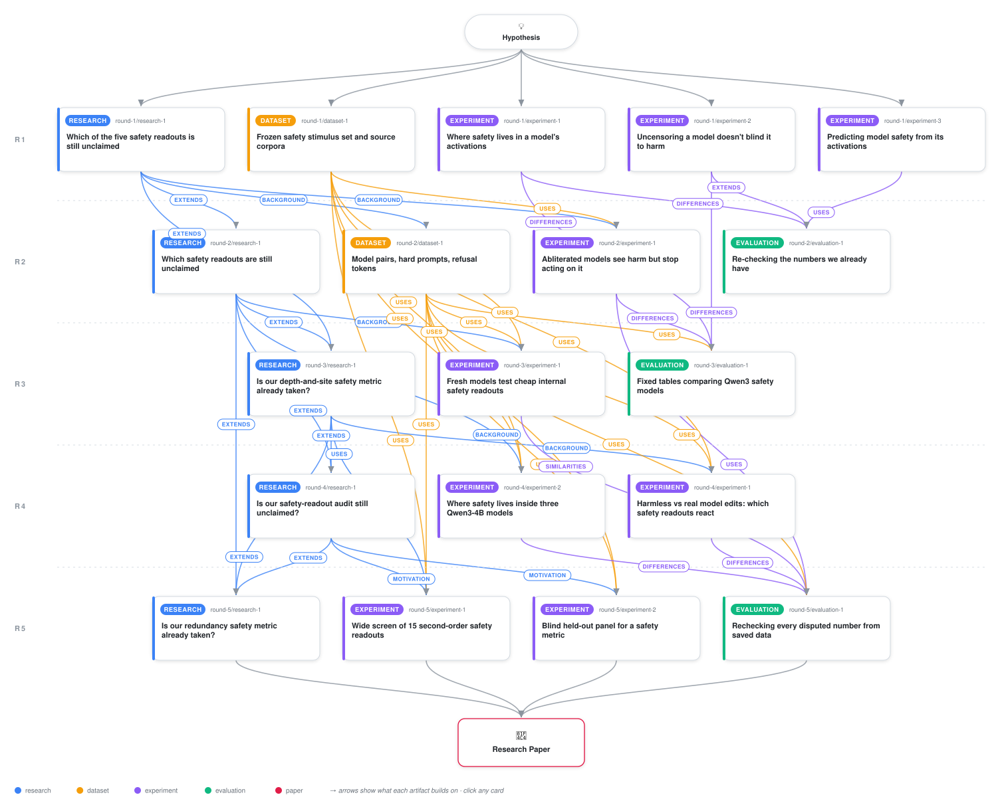

# Specificity and Causality Audits for Activation-Based Safety Readouts

<div align="center">

<a href="https://cdn.jsdelivr.net/gh/ai-inventor-papers/ai-invention-f8532e-safety-only-checks-output-when-warned@main/workflow.svg">
<picture>
  <source media="(prefers-color-scheme: dark)" srcset="workflow-dark.svg">
  
</picture>
</a>

<sub>🖱️ <b><a href="https://cdn.jsdelivr.net/gh/ai-inventor-papers/ai-invention-f8532e-safety-only-checks-output-when-warned@main/workflow.svg">Open the interactive diagram</a></b> — every card links to its artifact folder.</sub>

</div>

> **TL;DR** — Complete paper draft (iteration 5) addressing all 10 reviewer MUST-FIX items from iteration 4. Key changes: (1) Added Table 1 with all 15 NOOP + 9 effective pairs by ID across four categories. (2) Marked 3 head-only (wu05) pairs as structurally invariant; reported both 15-pair and 12-pair numbers. (3) Reported all 4 BL1 variants and disclosed the BL1_truelogit ordering flip. (4) Printed all 32 candidates in Table 2. (5) Full 18-cell causal grid effect sizes in Table 3 with equivalence framing (max |effect| 0.056 vs MDE 0.067). (6) Added equivalence tests (TOST p < 1e-23) and disclosed abliterated floor. (7) Added Prompt Budget section (k=32 detection, 30-150 ranking). (8) Replaced bitwise explanation with measured displacements (6.2x ratio). (9) Added Experimental Setup section, method schematic figure, displacement and probe figures. (10) Fixed bibliography (JailbreakBench=Chao2024, cited Wollschlager, Spagliardi), disclosed deviations. The paper includes 5 figures and 4 tables across 8 sections. 42 references from Semantic Scholar.

<details>
<summary>Full hypothesis</summary>

FINAL-ITERATION DECLARATION. The run's answer to the ask is stated in three parts, each with the executed numbers it rests on and the bounds it could not cross. Nothing below is projected; every number names the artifact it is read from, and where two artifacts disagree the disagreement is printed rather than resolved by fiat.

PART 1 -- THE COMMISSIONED ACTIVATION-LEVEL COMPARISON (Qwen3-4B Base / instruct / SafeRL / mlabonne-abliterated, with the CohenQu STaR non-safety fine-tune as control). This is the deliverable and it is positive.
 (a) Instruction tuning CREATES the request axis: Base-instruct |cos| <= 0.53 across six depth-fraction bands, and Base separates harmful from benign only weakly on its own axis (N1 0.08 vs instruct 2.33; iter-5 exp1 commissioned_quartet_headlines, iter-4 exp1 commissioned rows).
 (b) SafeRL KEEPS the axis and SHARPENS it: |cos(F_instruct, F_SafeRL)| >= 0.84-0.87 in every band, own-axis d 6.63 vs 5.78 (iter-5 exp1), N1 2.16 vs 2.33 and N6 4.06 vs 4.13 on the iter-4 instrument -- so the two safety-tuned models are near-identical at the LEVEL of separability and near-identical in DIRECTION.
 (c) What DOES differ between instruct and SafeRL is causal REDUNDANCY, not level: all-position ablation of F in band B4 drops instruct judged refusal 0.917 -> 0.667 (effect -0.33 [-0.48, -0.21]) while SafeRL resists, difference-in-differences +0.229 [+0.083, +0.375] (iter-4 exp2). This is the one cell where a per-checkpoint quantity separates the two official safety models; the registered per-cell DiD across the 18-cell grid is NOT supported (8/18 in the predicted direction) and is reported as unsupported.
 (d) Abliteration BOTH ROTATES AND SHRINKS the axis. Rotation: parent-child |cos(F)| 0.983 / 0.772 / 0.362 / 0.015 / 0.130 / 0.217 over B1-B6 on the iter-5 exp1 band convention, versus 0.999 / 0.994 / 0.943 / 0.412 / 0.306 / 0.328 on the iter-4 exp2 convention -- both vectors are printed, the iter-5 vector is primary because its convention reproduces the iter-4 cosines to <1e-6 and covers all six bands on one instrument, and the disagreement is a stated limitation of band conventions. Shrinkage: per-band |F| ratio 0.933 / 0.840 / 0.864 / 0.571 / 0.578 / 0.603 (about 40% lost at B4-B6), |F|/mean-residual-norm 0.351 vs 0.589 at B5; N1 2.33 -> 0.67 and N6 4.13 -> 1.78 on the iter-4 instrument; N6 magnitude -16% on the iter-5 eval re-derivation. The inherited sentence 'rotates but does not shrink' and the unsourced 1.87-vs-1.79 pair are WITHDRAWN. The child still separates harmful from benign on its OWN axis (d 4.83 at B4) while the parent's axis is blind on it (d 0.22): abliteration relocates the request representation rather than deleting it. Removing the child's own F RAISES its refusal-onset mass (sign reversal), and its arm-0 refusal is 0.188 so its grid is 6 cells at site P with a floor effect, stated as such.
 (e) A non-safety fine-tune rotates far less (STaR |cos| 0.43 with Base; lands near Base on N1/N6), so the pattern in (a)-(d) tracks safety tuning and not fine-tuning as such.
 (f) Base is absent from the intervention grid because a redundancy scalar is undefined in a model with no refusal behaviour (Base HC 0.02 is incoherence, not safety; the W-family normaliser degenerates on pythia-410m and Pleias-1.2b for the same reason). That sentence goes in the paper in place of the missing cell.

PART 2 -- PATTERNS IN INTERNAL COMPUTATION ON SAFETY PROMPTS. Three executed findings, each stated with its bound.
 (g) DECODABLE BUT INERT, as a BOUND. Site-local removal of F at the last prompt token moves the first-token refusal-onset log-mass by -2.87 / -2.59 / -1.58 nats at B4-B6 (instruct) and drops a keyword proxy 0.79 -> 0.15, yet judged refusal of harmful requests moves in 0 of 18 cells in instruct and 0 of 18 in SafeRL: max |effect| 0.056 against MDE80 0.067 / 0.061, TOST-equivalent in all three models. Stated as 'no site-local effect larger than about 0.07 in judged refusal', with the caveat that the positive control (POS residual patch) exists ONLY for the forward-only readouts (RD_harm -4.170 at B4) and there is NO judged-refusal positive control -- the bound is on the judged outcome, the machinery's ability to move the judged outcome is undemonstrated, and both sentences go in Results and Limitations. 11 of 12 decodable instruct cells (AUROC CI lower bound > 0.60) are inert; the 12th is the sole Holm-18 survivor. This is Basu's knowledge-action gap and Zhao et al. 2507.11878's harmfulness-versus-refusal separation replicated at site resolution inside one model, cited as a premise; the delta is the 6x3 grid, the matched-displacement random control (which displaces 2.0-2.5x MORE than F off site P) and the equivalence bound.
 (h) OVER-REFUSAL IS THE ONLY SITE-LOCAL WRITE-HANDLE: F and N6 at B4-B5 lower hard-benign over-refusal by 0.12-0.19 in both models; instruct N6 @ P_B5 -0.146 [-0.24, -0.06] is the only Holm-18 survivor and it ranks 4th by raw |effect|. Both grids (judged refusal and over-refusal, arms F and N6, both models, arm-0 baselines and MDE80 in the caption) must be printed; the current draft shows neither the judged-refusal grid nor the starred N6 cell.
 (i) THE PROBE-SURVIVAL RESULT IS RESTATED AT THE OPERATING POINT. AUROC 1.000 under the rank-one lesion is AT CEILING in the unperturbed control and cannot register the lesion; re-expressed as TPR@1%FPR the representation SURVIVES at the true prompt site (flat) and is LOST at the response site (dTPR -0.083 / -0.185 / -0.138 / -0.169 over L1-L4, two CIs excluding zero), and iteration 2's 'prompt site' label was the EARLY RESPONSE window. The 138x accumulator claim is DELETED: with the axis frozen at layer 13 the norm-controlled gap DECAYS with depth; apparent 161-281x growth appears only when the axis is refit per layer, i.e. layer-specific rewriting, not accumulation along one coordinate (iter-3 eval).

PART 3 -- THE FEW-PROMPT METRIC: NO SURVIVOR, AND WHY THAT IS THE RESULT. Five pre-registered screens across five iterations, 32 first-order and 15 second-order single-model readouts, produced no readout that beats the final-layer logit gap or AMS sigma on a held-out panel at the registered margin. What they DID establish, in decreasing strength:
 (j) THE POWERED SPECIFICITY RESULT (headline, promoted from the appendix). On 24 behaviourally graded no-op edits from the iteration-5 screen panel, the five geometric readouts G1-G4 and A3, the plain difference-in-means and A1_slope raise b=0 false alarms where BL1_easy raises c=11 (exact McNemar p = 0.00098); 0 vs 7 (p = 0.0156) on the 18-pair non-degenerate subset; W2 0 vs 7 (p = 0.0156) on its 14 evaluable pairs (0 vs 4, p = 0.125 non-degenerate); W1 is LESS specific than the logit gap (6 vs 1, p = 0.125; 5 vs 0 non-degenerate) and W7 is 5 vs 3 (p = 0.73), so the specificity gain belongs to the geometric family, not to the write-handle family. The first-order 12-pair comparison (BL1_easy 4 vs N1 1, p = 0.375) is the UNDERPOWERED subset result and is demoted to a secondary line. The sensitivity cost is reported in the same sentence: G3 3/10, G1 2/10, G4 2/10, A3 1/10, W1/W2/W7 0/10 real edits detected. False-alarm count and sensitivity are POSITIVELY correlated across the 32 first-order readouts (Spearman +0.596; +0.406 within the activation class): there is no trade-off to buy, the specific readouts are simply insensitive.
 (k) THE SIGN INVERSION IS THE MOST INFORMATIVE THING THE SCREEN PRODUCED. On the 12 blind checkpoints EVERY second-order candidate's sign is opposite to its registered expectation: the same quantity that predicts LOWER over-refusal (W3 -0.943 n=6, G4 -0.815 n=12, difference-in-means floor -0.683, G3 -0.673) predicts HIGHER harmful compliance (G3 +0.77, G4 +0.64, W3 +0.75). These readouts locate a checkpoint on the refusal/permissiveness TRADE-OFF; they do not measure 'more safety'. The final-layer logit gap (+0.152 vs OR, -0.387 vs HC) and AMS sigma (+0.657 vs OR, -0.696 vs HC, n=6) carry the OPPOSITE sign to every activation candidate on the same panel. Both correlation columns go in one table, and this sentence goes in the abstract and Contribution 4.
 (l) THE ONE-COORDINATE BOUND (P1) IS REFUTED. Effective rank of the 15 x 48 score matrix is 7.16 (entropy) / 5.32 (participation), 6.24 / 4.66 on the 42 fully covered rows, leading singular vector |cos| 0.645 with z(BL1_easy) against a 0.8 threshold. Cheap single-model readouts span several coordinates; the request axis does not exhaust them. The prior-art pass finds no factor-analytic treatment of a family of INTERNAL safety scores, so this is positioned against IRT-for-AI-Safety 2608.05086 and Hidden Dimensions 2502.09674, separating score-family rank from refusal-subspace rank.
 (m) THE REGISTERED CONFIRMATION FAILED FOR POWER, NOT FOR SIGN. At n=12 the MDE is 0.73 and no paired checkpoint-bootstrap margin over BL1_easy excludes zero; under a lineage-cluster bootstrap (7 lineages) G4 (+0.663 [+0.096, +0.813]) and W3 (+0.914 [+0.227, +0.943]) DO exclude zero, reported as a post-freeze sensitivity and never as a pass. W2 is NaN on every held-out row (censored). The 20-checkpoint blind producer panel (9 never-loaded families) was harvested and graded but its labels were NEVER JOINED to any candidate (D11 COULD_NOT_COMPLETE): it is released as a sealed substrate for whoever runs the confirmation the run could not.
 (n) THE ONLY ACTIVATION READOUT WHOSE HELD-OUT CI EXCLUDES ZERO is the iteration-2 held-out diff-in-means d, misfiled in the draft as 'weights-only B3': on the n=10 fresh-family panel rho = -0.89 [-0.97, -0.57] against harmful compliance where BL1 is -0.62 [-0.93, +0.02] and the critical |rho| is 0.648 as published and 0.636 when recomputed from disk (both printed; partial rho(B3 | BL1) -0.816). The paired margin is not resolvable at n=10; power arithmetic (Williams' t, rho(B3,BL1) 0.65) puts reliable RANKING at 30-150 checkpoints, DETECTION of an abliterated child at k=32 prompts (request-axis d drops on 8/8 effective abliterated pairs, every CI below zero; N1 reverses on mylesgoose and is flagged).
 (o) BEHAVIOURAL NO-OPS ARE HARD TO CONSTRUCT, and that is a finding about the field's calibration practice. Of the 15 iteration-4 no-ops the observed composition is precision x8, head-only unembedding x3, system-prompt x2, non-safety DPO x1 (F3 only), rank-one lesion alpha 0.05 x1; all three LoRA arms failed (two OR_EFFECTIVE, one AMBIGUOUS), two of three DPO arms failed, re-saves excluded as trivially zero. On the iteration-5 ERNIE-0.3B parent, 0 of 5 declared non-degenerate no-ops behaved as no-ops (int8 round-trip OR_EFFECTIVE; LoRA, DPO and a benign system-prompt swap EFFECTIVE; fp16 and unembedding perturbation AMBIGUOUS). Every published readout that calibrates on 'benign' variants without grading them (AMS's 4.4% drift, Duan, Hurtado) inherits this.

WHAT THE RUN CANNOT SAY. No single-model activation or weight readout was confirmed as a few-prompt safety score at the registered margin; the trade-off-position characterisation (k) is a point-estimate result on 12 checkpoints; the redundancy contrast (c) is one band in one lineage with no positive control on the judged outcome; the instruct/SafeRL over-refusal ordering is benign-set dependent (XSTest twins 0.44 / 0.33 vs hard-benign probes 0.375-0.4375 / 0.4792-0.5833) and the BL1 instruct/SafeRL ordering is variant dependent (easy 4.92 / 3.60, truelogit 6.65 / 7.46), both stated as cautions.

REQUIREMENTS OF THE FINAL PAPER, taken from the reviewer and binding. (1) Contribution 3 rewritten to 'rotates AND shrinks' with the |F| ratio vector, both cosine vectors and the three magnitude numbers reconciled by item set. (2) 138x and 'accumulator' deleted; probe survival re-expressed at TPR@1%FPR by site with the site-label correction. (3) wu05 correctly described as a targeted 0.5-nat suppression of refusal-onset token logits (not random), with the consequence that BL1's wu05 false alarms are real logit changes that are behaviourally inert; AMS rows footnoted with the 5 of 15 pairs whose input is copied from the parent by construction and AMS specificity reported on the 10 movable pairs. (4) The 0-vs-11 McNemar promoted to Section 5.1 and the abstract; 4-vs-1 demoted. (5) Sign-inversion paragraph and two-column correlation table added. (6) B3 relabelled as the activation readout it is, with a figure for the n=10 panel and the k-curve. (7) Grading counts corrected to 85 harmful / 83 benign for the specificity panel, amendment A6 (F1 168x96, F2/F3 128x64) added to Deviations and Table 1, StrongREJECT cited to Souly et al. (8) Two causal grids printed, fig_causal_grid made a 2x2 over outcome x model, POS values and their absence for the judged outcome stated. (9) Every count regenerated from aggregates.json: 9 effective (10 under the frozen rule, both AMD SFT->DPO provenance rows shown), BL1 5-8 of 15, activation 0-3 of 12, BL1 3-6 of 12, '12 of 18 decodable cells'; pass/fail language replaced by the measured comparison. (10) Zhao 2507.11878, Yang 2609.18471 and Maskey 2603.27518 cited at point of use; novelty narrowed to 'over-refusal as the prediction target of a per-checkpoint internal readout across a checkpoint panel'; the 12 uncited bib entries pruned or cited; 0.016 sourced or deleted and the pooled rank-one share 0.433 printed beside the per-matrix median 0.99. (11) Classification precedence stated (NOOP evaluated first; F1__int8wo's dOR CI [0.012, 0.096] excludes zero but sits inside the band) with dHC and dOR CIs on every Table 1 row, and BL1's count given with and without F1__int8wo. (12) A Panels table distinguishing n=48 screen, n=12 blind confirmation, n=10 iteration-3 ranking and n=20 producer panel, with provenance and overlap; B3/B7/N-row glossary; /8 vs /9 denominators footnoted. (13) The Qwen3-4B comparison gets its own subsection, figure, abstract sentence and conclusion sentence. (14) Abstract rewritten results-first with the numbers in (g), (j), (k), (l), (m) and (n).

FENCES, unchanged: no claim to a first cross-family few-prompt activation metric (AMS), a first internal scoring of abliterated checkpoints, reference-free or <=16 prompts as novelty, recognition/execution naming, any weights-only statistic, a first decode-site readout, a first readout-under-quantisation or benign-fine-tune false-positive rate, a first logit-versus-activation comparison, a first random-direction control, or the read-versus-write dissociation itself. Self-repair and backup under ablation are the Hydra effect and Rushing & Nanda; redundancy-as-a-per-checkpoint-scalar is stated as OPEN on a dated search (2026-09-22) and not as a validated metric. The surviving novelty sentence is: a per-checkpoint false-alarm audit on BEHAVIOURALLY GRADED no-ops, over-refusal as the prediction TARGET of a per-checkpoint internal readout across a panel, the logit gap and AMS sigma reported side by side, and the finding that mid-layer separation geometry indexes the refusal/permissiveness trade-off rather than a safety level.

</details>

[](https://ai-inventor-papers.github.io/ai-invention-f8532e-safety-only-checks-output-when-warned/)

[](https://cdn.jsdelivr.net/gh/ai-inventor-papers/ai-invention-f8532e-safety-only-checks-output-when-warned@main/paper.pdf) [](https://github.com/ai-inventor-papers/ai-invention-f8532e-safety-only-checks-output-when-warned/tree/main/paper_latex)

This repository contains all **19 artifacts** produced across **5 rounds** of an autonomous AI research run — round by round, exactly in the order they were invented.

## Round 1

| Artifact | Type | Demo | Source | Builds on |
|----------|------|------|--------|-----------|
| **[Which of the five safety readouts is still unclaimed](https://github.com/ai-inventor-papers/ai-invention-f8532e-safety-only-checks-output-when-warned/tree/main/round-1/research-1)** | [](https://github.com/ai-inventor-papers/ai-invention-f8532e-safety-only-checks-output-when-warned/tree/main/round-1/research-1) | [](https://github.com/ai-inventor-papers/ai-invention-f8532e-safety-only-checks-output-when-warned/blob/main/round-1/research-1/demo/research_demo.md) | [](https://github.com/ai-inventor-papers/ai-invention-f8532e-safety-only-checks-output-when-warned/tree/main/round-1/research-1/src) | — |
| **[Frozen safety stimulus set and source corpora](https://github.com/ai-inventor-papers/ai-invention-f8532e-safety-only-checks-output-when-warned/tree/main/round-1/dataset-1)** | [](https://github.com/ai-inventor-papers/ai-invention-f8532e-safety-only-checks-output-when-warned/tree/main/round-1/dataset-1) | [](https://colab.research.google.com/github/ai-inventor-papers/ai-invention-f8532e-safety-only-checks-output-when-warned/blob/main/round-1/dataset-1/demo/art_jn337OmvTVjZ) | [](https://github.com/ai-inventor-papers/ai-invention-f8532e-safety-only-checks-output-when-warned/tree/main/round-1/dataset-1/src) | — |
| **[Where safety lives in a model's activations](https://github.com/ai-inventor-papers/ai-invention-f8532e-safety-only-checks-output-when-warned/tree/main/round-1/experiment-1)** | [](https://github.com/ai-inventor-papers/ai-invention-f8532e-safety-only-checks-output-when-warned/tree/main/round-1/experiment-1) | [](https://colab.research.google.com/github/ai-inventor-papers/ai-invention-f8532e-safety-only-checks-output-when-warned/blob/main/round-1/experiment-1/demo/art_2QM9uBviY4Wk) | [](https://github.com/ai-inventor-papers/ai-invention-f8532e-safety-only-checks-output-when-warned/tree/main/round-1/experiment-1/src) | — |
| **[Uncensoring a model doesn't blind it to harm](https://github.com/ai-inventor-papers/ai-invention-f8532e-safety-only-checks-output-when-warned/tree/main/round-1/experiment-2)** | [](https://github.com/ai-inventor-papers/ai-invention-f8532e-safety-only-checks-output-when-warned/tree/main/round-1/experiment-2) | [](https://colab.research.google.com/github/ai-inventor-papers/ai-invention-f8532e-safety-only-checks-output-when-warned/blob/main/round-1/experiment-2/demo/art_2sz7g3MD4_y3) | [](https://github.com/ai-inventor-papers/ai-invention-f8532e-safety-only-checks-output-when-warned/tree/main/round-1/experiment-2/src) | — |
| **[Predicting model safety from its activations](https://github.com/ai-inventor-papers/ai-invention-f8532e-safety-only-checks-output-when-warned/tree/main/round-1/experiment-3)** | [](https://github.com/ai-inventor-papers/ai-invention-f8532e-safety-only-checks-output-when-warned/tree/main/round-1/experiment-3) | [](https://colab.research.google.com/github/ai-inventor-papers/ai-invention-f8532e-safety-only-checks-output-when-warned/blob/main/round-1/experiment-3/demo/art_rpTmjn5qclSY) | [](https://github.com/ai-inventor-papers/ai-invention-f8532e-safety-only-checks-output-when-warned/tree/main/round-1/experiment-3/src) | — |

## Round 2

| Artifact | Type | Demo | Source | Builds on |
|----------|------|------|--------|-----------|
| **[Which safety readouts are still unclaimed](https://github.com/ai-inventor-papers/ai-invention-f8532e-safety-only-checks-output-when-warned/tree/main/round-2/research-1)** | [](https://github.com/ai-inventor-papers/ai-invention-f8532e-safety-only-checks-output-when-warned/tree/main/round-2/research-1) | [](https://github.com/ai-inventor-papers/ai-invention-f8532e-safety-only-checks-output-when-warned/blob/main/round-2/research-1/demo/research_demo.md) | [](https://github.com/ai-inventor-papers/ai-invention-f8532e-safety-only-checks-output-when-warned/tree/main/round-2/research-1/src) | <sub><i>extends:</i><br/>[research‑1&nbsp;(R1)](https://github.com/ai-inventor-papers/ai-invention-f8532e-safety-only-checks-output-when-warned/tree/main/round-1/research-1)</sub> |
| **[Model pairs, hard prompts, refusal tokens](https://github.com/ai-inventor-papers/ai-invention-f8532e-safety-only-checks-output-when-warned/tree/main/round-2/dataset-1)** | [](https://github.com/ai-inventor-papers/ai-invention-f8532e-safety-only-checks-output-when-warned/tree/main/round-2/dataset-1) | [](https://colab.research.google.com/github/ai-inventor-papers/ai-invention-f8532e-safety-only-checks-output-when-warned/blob/main/round-2/dataset-1/demo/art_1hlgObsQWnZS) | [](https://github.com/ai-inventor-papers/ai-invention-f8532e-safety-only-checks-output-when-warned/tree/main/round-2/dataset-1/src) | <sub><i>background:</i><br/>[research‑1&nbsp;(R1)](https://github.com/ai-inventor-papers/ai-invention-f8532e-safety-only-checks-output-when-warned/tree/main/round-1/research-1)</sub> |
| **[Abliterated models see harm but stop acting on it](https://github.com/ai-inventor-papers/ai-invention-f8532e-safety-only-checks-output-when-warned/tree/main/round-2/experiment-1)** | [](https://github.com/ai-inventor-papers/ai-invention-f8532e-safety-only-checks-output-when-warned/tree/main/round-2/experiment-1) | [](https://colab.research.google.com/github/ai-inventor-papers/ai-invention-f8532e-safety-only-checks-output-when-warned/blob/main/round-2/experiment-1/demo/art_OyQwmkiWj-5u) | [](https://github.com/ai-inventor-papers/ai-invention-f8532e-safety-only-checks-output-when-warned/tree/main/round-2/experiment-1/src) | <sub><i>uses:</i><br/>[dataset‑1&nbsp;(R1)](https://github.com/ai-inventor-papers/ai-invention-f8532e-safety-only-checks-output-when-warned/tree/main/round-1/dataset-1)<br/><i>background:</i><br/>[research‑1&nbsp;(R1)](https://github.com/ai-inventor-papers/ai-invention-f8532e-safety-only-checks-output-when-warned/tree/main/round-1/research-1)</sub> |
| **[Re-checking the numbers we already have](https://github.com/ai-inventor-papers/ai-invention-f8532e-safety-only-checks-output-when-warned/tree/main/round-2/evaluation-1)** | [](https://github.com/ai-inventor-papers/ai-invention-f8532e-safety-only-checks-output-when-warned/tree/main/round-2/evaluation-1) | [](https://colab.research.google.com/github/ai-inventor-papers/ai-invention-f8532e-safety-only-checks-output-when-warned/blob/main/round-2/evaluation-1/demo/art_G5pqEoRFZ75t) | [](https://github.com/ai-inventor-papers/ai-invention-f8532e-safety-only-checks-output-when-warned/tree/main/round-2/evaluation-1/src) | <sub><i>differences:</i><br/>[experiment‑1&nbsp;(R1)](https://github.com/ai-inventor-papers/ai-invention-f8532e-safety-only-checks-output-when-warned/tree/main/round-1/experiment-1)<br/><i>extends:</i><br/>[experiment‑2&nbsp;(R1)](https://github.com/ai-inventor-papers/ai-invention-f8532e-safety-only-checks-output-when-warned/tree/main/round-1/experiment-2)<br/><i>uses:</i><br/>[experiment‑3&nbsp;(R1)](https://github.com/ai-inventor-papers/ai-invention-f8532e-safety-only-checks-output-when-warned/tree/main/round-1/experiment-3)</sub> |

## Round 3

| Artifact | Type | Demo | Source | Builds on |
|----------|------|------|--------|-----------|
| **[Fresh models test cheap internal safety readouts](https://github.com/ai-inventor-papers/ai-invention-f8532e-safety-only-checks-output-when-warned/tree/main/round-3/experiment-1)** | [](https://github.com/ai-inventor-papers/ai-invention-f8532e-safety-only-checks-output-when-warned/tree/main/round-3/experiment-1) | [](https://colab.research.google.com/github/ai-inventor-papers/ai-invention-f8532e-safety-only-checks-output-when-warned/blob/main/round-3/experiment-1/demo/art_MD4Voiyi__oM) | [](https://github.com/ai-inventor-papers/ai-invention-f8532e-safety-only-checks-output-when-warned/tree/main/round-3/experiment-1/src) | <sub><i>uses:</i><br/>[dataset‑1&nbsp;(R2)](https://github.com/ai-inventor-papers/ai-invention-f8532e-safety-only-checks-output-when-warned/tree/main/round-2/dataset-1)<br/>[dataset‑1&nbsp;(R1)](https://github.com/ai-inventor-papers/ai-invention-f8532e-safety-only-checks-output-when-warned/tree/main/round-1/dataset-1)<br/><i>background:</i><br/>[research‑1&nbsp;(R2)](https://github.com/ai-inventor-papers/ai-invention-f8532e-safety-only-checks-output-when-warned/tree/main/round-2/research-1)</sub> |
| **[Fixed tables comparing Qwen3 safety models](https://github.com/ai-inventor-papers/ai-invention-f8532e-safety-only-checks-output-when-warned/tree/main/round-3/evaluation-1)** | [](https://github.com/ai-inventor-papers/ai-invention-f8532e-safety-only-checks-output-when-warned/tree/main/round-3/evaluation-1) | [](https://colab.research.google.com/github/ai-inventor-papers/ai-invention-f8532e-safety-only-checks-output-when-warned/blob/main/round-3/evaluation-1/demo/art_W7mvvZfSkDW3) | [](https://github.com/ai-inventor-papers/ai-invention-f8532e-safety-only-checks-output-when-warned/tree/main/round-3/evaluation-1/src) | <sub><i>differences:</i><br/>[experiment‑1&nbsp;(R2)](https://github.com/ai-inventor-papers/ai-invention-f8532e-safety-only-checks-output-when-warned/tree/main/round-2/experiment-1)<br/>[experiment‑2&nbsp;(R1)](https://github.com/ai-inventor-papers/ai-invention-f8532e-safety-only-checks-output-when-warned/tree/main/round-1/experiment-2)<br/>[experiment‑1&nbsp;(R1)](https://github.com/ai-inventor-papers/ai-invention-f8532e-safety-only-checks-output-when-warned/tree/main/round-1/experiment-1)<br/><i>uses:</i><br/>[dataset‑1&nbsp;(R2)](https://github.com/ai-inventor-papers/ai-invention-f8532e-safety-only-checks-output-when-warned/tree/main/round-2/dataset-1)</sub> |
| **[Is our depth-and-site safety metric already taken?](https://github.com/ai-inventor-papers/ai-invention-f8532e-safety-only-checks-output-when-warned/tree/main/round-3/research-1)** | [](https://github.com/ai-inventor-papers/ai-invention-f8532e-safety-only-checks-output-when-warned/tree/main/round-3/research-1) | [](https://github.com/ai-inventor-papers/ai-invention-f8532e-safety-only-checks-output-when-warned/blob/main/round-3/research-1/demo/research_demo.md) | [](https://github.com/ai-inventor-papers/ai-invention-f8532e-safety-only-checks-output-when-warned/tree/main/round-3/research-1/src) | <sub><i>extends:</i><br/>[research‑1&nbsp;(R2)](https://github.com/ai-inventor-papers/ai-invention-f8532e-safety-only-checks-output-when-warned/tree/main/round-2/research-1)<br/>[research‑1&nbsp;(R1)](https://github.com/ai-inventor-papers/ai-invention-f8532e-safety-only-checks-output-when-warned/tree/main/round-1/research-1)</sub> |

## Round 4

| Artifact | Type | Demo | Source | Builds on |
|----------|------|------|--------|-----------|
| **[Harmless vs real model edits: which safety readouts react](https://github.com/ai-inventor-papers/ai-invention-f8532e-safety-only-checks-output-when-warned/tree/main/round-4/experiment-1)** | [](https://github.com/ai-inventor-papers/ai-invention-f8532e-safety-only-checks-output-when-warned/tree/main/round-4/experiment-1) | [](https://colab.research.google.com/github/ai-inventor-papers/ai-invention-f8532e-safety-only-checks-output-when-warned/blob/main/round-4/experiment-1/demo/art_n2d3TASD1mDQ) | [](https://github.com/ai-inventor-papers/ai-invention-f8532e-safety-only-checks-output-when-warned/tree/main/round-4/experiment-1/src) | <sub><i>uses:</i><br/>[dataset‑1&nbsp;(R2)](https://github.com/ai-inventor-papers/ai-invention-f8532e-safety-only-checks-output-when-warned/tree/main/round-2/dataset-1)<br/>[dataset‑1&nbsp;(R1)](https://github.com/ai-inventor-papers/ai-invention-f8532e-safety-only-checks-output-when-warned/tree/main/round-1/dataset-1)<br/><i>background:</i><br/>[research‑1&nbsp;(R3)](https://github.com/ai-inventor-papers/ai-invention-f8532e-safety-only-checks-output-when-warned/tree/main/round-3/research-1)</sub> |
| **[Where safety lives inside three Qwen3-4B models](https://github.com/ai-inventor-papers/ai-invention-f8532e-safety-only-checks-output-when-warned/tree/main/round-4/experiment-2)** | [](https://github.com/ai-inventor-papers/ai-invention-f8532e-safety-only-checks-output-when-warned/tree/main/round-4/experiment-2) | [](https://colab.research.google.com/github/ai-inventor-papers/ai-invention-f8532e-safety-only-checks-output-when-warned/blob/main/round-4/experiment-2/demo/art_TXjj0m4OyRIg) | [](https://github.com/ai-inventor-papers/ai-invention-f8532e-safety-only-checks-output-when-warned/tree/main/round-4/experiment-2/src) | <sub><i>uses:</i><br/>[dataset‑1&nbsp;(R2)](https://github.com/ai-inventor-papers/ai-invention-f8532e-safety-only-checks-output-when-warned/tree/main/round-2/dataset-1)<br/>[dataset‑1&nbsp;(R1)](https://github.com/ai-inventor-papers/ai-invention-f8532e-safety-only-checks-output-when-warned/tree/main/round-1/dataset-1)<br/><i>background:</i><br/>[research‑1&nbsp;(R2)](https://github.com/ai-inventor-papers/ai-invention-f8532e-safety-only-checks-output-when-warned/tree/main/round-2/research-1)</sub> |
| **[Is our safety-readout audit still unclaimed?](https://github.com/ai-inventor-papers/ai-invention-f8532e-safety-only-checks-output-when-warned/tree/main/round-4/research-1)** | [](https://github.com/ai-inventor-papers/ai-invention-f8532e-safety-only-checks-output-when-warned/tree/main/round-4/research-1) | [](https://github.com/ai-inventor-papers/ai-invention-f8532e-safety-only-checks-output-when-warned/blob/main/round-4/research-1/demo/research_demo.md) | [](https://github.com/ai-inventor-papers/ai-invention-f8532e-safety-only-checks-output-when-warned/tree/main/round-4/research-1/src) | <sub><i>extends:</i><br/>[research‑1&nbsp;(R3)](https://github.com/ai-inventor-papers/ai-invention-f8532e-safety-only-checks-output-when-warned/tree/main/round-3/research-1)<br/>[research‑1&nbsp;(R2)](https://github.com/ai-inventor-papers/ai-invention-f8532e-safety-only-checks-output-when-warned/tree/main/round-2/research-1)</sub> |

## Round 5

| Artifact | Type | Demo | Source | Builds on |
|----------|------|------|--------|-----------|
| **[Wide screen of 15 second-order safety readouts](https://github.com/ai-inventor-papers/ai-invention-f8532e-safety-only-checks-output-when-warned/tree/main/round-5/experiment-1)** | [](https://github.com/ai-inventor-papers/ai-invention-f8532e-safety-only-checks-output-when-warned/tree/main/round-5/experiment-1) | [](https://colab.research.google.com/github/ai-inventor-papers/ai-invention-f8532e-safety-only-checks-output-when-warned/blob/main/round-5/experiment-1/demo/art_l3WSWrVMeJZU) | [](https://github.com/ai-inventor-papers/ai-invention-f8532e-safety-only-checks-output-when-warned/tree/main/round-5/experiment-1/src) | <sub><i>uses:</i><br/>[dataset‑1&nbsp;(R2)](https://github.com/ai-inventor-papers/ai-invention-f8532e-safety-only-checks-output-when-warned/tree/main/round-2/dataset-1)<br/>[dataset‑1&nbsp;(R1)](https://github.com/ai-inventor-papers/ai-invention-f8532e-safety-only-checks-output-when-warned/tree/main/round-1/dataset-1)<br/>[research‑1&nbsp;(R3)](https://github.com/ai-inventor-papers/ai-invention-f8532e-safety-only-checks-output-when-warned/tree/main/round-3/research-1)<br/><i>motivation:</i><br/>[research‑1&nbsp;(R4)](https://github.com/ai-inventor-papers/ai-invention-f8532e-safety-only-checks-output-when-warned/tree/main/round-4/research-1)</sub> |
| **[Blind held-out panel for a safety metric](https://github.com/ai-inventor-papers/ai-invention-f8532e-safety-only-checks-output-when-warned/tree/main/round-5/experiment-2)** | [](https://github.com/ai-inventor-papers/ai-invention-f8532e-safety-only-checks-output-when-warned/tree/main/round-5/experiment-2) | [](https://colab.research.google.com/github/ai-inventor-papers/ai-invention-f8532e-safety-only-checks-output-when-warned/blob/main/round-5/experiment-2/demo/art_5lNob8bF1Yqi) | [](https://github.com/ai-inventor-papers/ai-invention-f8532e-safety-only-checks-output-when-warned/tree/main/round-5/experiment-2/src) | <sub><i>uses:</i><br/>[dataset‑1&nbsp;(R2)](https://github.com/ai-inventor-papers/ai-invention-f8532e-safety-only-checks-output-when-warned/tree/main/round-2/dataset-1)<br/>[dataset‑1&nbsp;(R1)](https://github.com/ai-inventor-papers/ai-invention-f8532e-safety-only-checks-output-when-warned/tree/main/round-1/dataset-1)<br/><i>motivation:</i><br/>[research‑1&nbsp;(R4)](https://github.com/ai-inventor-papers/ai-invention-f8532e-safety-only-checks-output-when-warned/tree/main/round-4/research-1)</sub> |
| **[Rechecking every disputed number from saved data](https://github.com/ai-inventor-papers/ai-invention-f8532e-safety-only-checks-output-when-warned/tree/main/round-5/evaluation-1)** | [](https://github.com/ai-inventor-papers/ai-invention-f8532e-safety-only-checks-output-when-warned/tree/main/round-5/evaluation-1) | [](https://colab.research.google.com/github/ai-inventor-papers/ai-invention-f8532e-safety-only-checks-output-when-warned/blob/main/round-5/evaluation-1/demo/art_iVXKySzvTVVk) | [](https://github.com/ai-inventor-papers/ai-invention-f8532e-safety-only-checks-output-when-warned/tree/main/round-5/evaluation-1/src) | <sub><i>differences:</i><br/>[experiment‑1&nbsp;(R4)](https://github.com/ai-inventor-papers/ai-invention-f8532e-safety-only-checks-output-when-warned/tree/main/round-4/experiment-1)<br/>[experiment‑2&nbsp;(R4)](https://github.com/ai-inventor-papers/ai-invention-f8532e-safety-only-checks-output-when-warned/tree/main/round-4/experiment-2)<br/><i>similarities:</i><br/>[experiment‑1&nbsp;(R3)](https://github.com/ai-inventor-papers/ai-invention-f8532e-safety-only-checks-output-when-warned/tree/main/round-3/experiment-1)<br/><i>uses:</i><br/>[experiment‑1&nbsp;(R2)](https://github.com/ai-inventor-papers/ai-invention-f8532e-safety-only-checks-output-when-warned/tree/main/round-2/experiment-1)<br/>[dataset‑1&nbsp;(R2)](https://github.com/ai-inventor-papers/ai-invention-f8532e-safety-only-checks-output-when-warned/tree/main/round-2/dataset-1)</sub> |
| **[Is our redundancy safety metric already taken?](https://github.com/ai-inventor-papers/ai-invention-f8532e-safety-only-checks-output-when-warned/tree/main/round-5/research-1)** | [](https://github.com/ai-inventor-papers/ai-invention-f8532e-safety-only-checks-output-when-warned/tree/main/round-5/research-1) | [](https://github.com/ai-inventor-papers/ai-invention-f8532e-safety-only-checks-output-when-warned/blob/main/round-5/research-1/demo/research_demo.md) | [](https://github.com/ai-inventor-papers/ai-invention-f8532e-safety-only-checks-output-when-warned/tree/main/round-5/research-1/src) | <sub><i>extends:</i><br/>[research‑1&nbsp;(R4)](https://github.com/ai-inventor-papers/ai-invention-f8532e-safety-only-checks-output-when-warned/tree/main/round-4/research-1)<br/>[research‑1&nbsp;(R3)](https://github.com/ai-inventor-papers/ai-invention-f8532e-safety-only-checks-output-when-warned/tree/main/round-3/research-1)<br/>[research‑1&nbsp;(R2)](https://github.com/ai-inventor-papers/ai-invention-f8532e-safety-only-checks-output-when-warned/tree/main/round-2/research-1)</sub> |

## Repository Structure

Artifacts are grouped by the round of invention that produced them. Each
artifact has its own folder with source code and a self-contained demo:

```
.
├── round-1/                         # One folder per round of invention
│   ├── experiment-1/
│   │   ├── README.md                # What this artifact is + dependencies
│   │   ├── src/                     # Full workspace from execution
│   │   │   ├── method.py            # Main implementation
│   │   │   ├── method_out.json      # Full output data
│   │   │   └── ...                  # All execution artifacts
│   │   └── demo/                    # Self-contained demo
│   │       └── method_code_demo.ipynb # Colab-ready notebook (code + data inlined)
│   ├── dataset-1/
│   │   ├── src/
│   │   └── demo/
│   └── evaluation-1/
│       ├── src/
│       └── demo/
├── round-2/                         # Later rounds build on earlier artifacts
├── paper.pdf                        # Research paper
├── paper_latex/                     # LaTeX source files
├── chat/                            # Every prompt, response and tool call, per module
├── workflow.svg                     # Artifact dependency diagram (this page's header)
└── README.md
```

## Running Notebooks

### Option 1: Google Colab (Recommended)

Click the "Open in Colab" badges above to run notebooks directly in your browser.
No installation required!

### Option 2: Local Jupyter

```bash
# Clone the repo
git clone https://github.com/ai-inventor-papers/ai-invention-f8532e-safety-only-checks-output-when-warned
cd ai-invention-f8532e-safety-only-checks-output-when-warned

# Install dependencies
pip install jupyter

# Run any artifact's demo notebook
jupyter notebook <artifact_folder>/demo/
```

## Source Code

The original source files are in each artifact's `src/` folder.
These files may have external dependencies - use the demo notebooks for a self-contained experience.

---
*Generated by AI Inventor Pipeline - Automated Research Generation*
